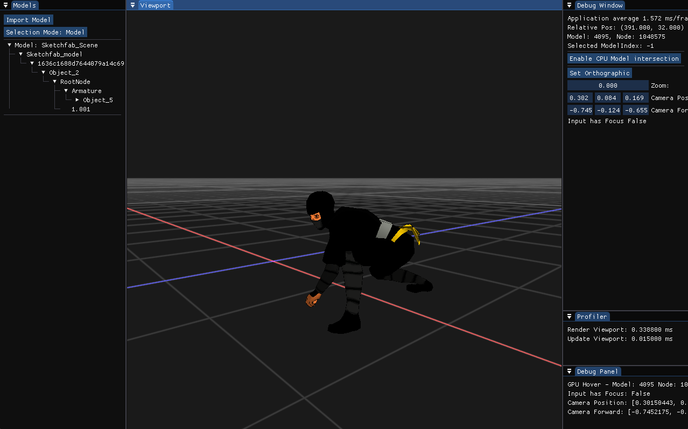

# Simple Vulkan Engine

Model used for Preview: [low-poly-ninja](https://sketchfab.com/3d-models/low-poly-ninja-d348e1612f0644069a4231588c2ae1c7)
## Overview

A lightweight Vulkan-based rendering engine focused on simplicity and clarity.
Currently, the project implements a **basic model renderer** with model selection and transformation and supports skeletal animation.

---

## Features

* Load **glTF models**
* Render **skeletal animations**
* Select individual **models and meshes**
* Transform (move) objects within the scene

---

## Controls

### Camera

* **Hold Right Mouse Button** — Enable first-person camera mode
* **W / A / S / D** — Move camera
* **Mouse Movement** — Look around / change view direction
* **Left Ctrl (hold)** — Increase movement speed

---

## Getting Started

For build and setup instructions, see: [Build.md](Build.md)

---

## Notes

* Requires a Vulkan-compatible system to run
* Designed and tested on Windows and Linux environments
